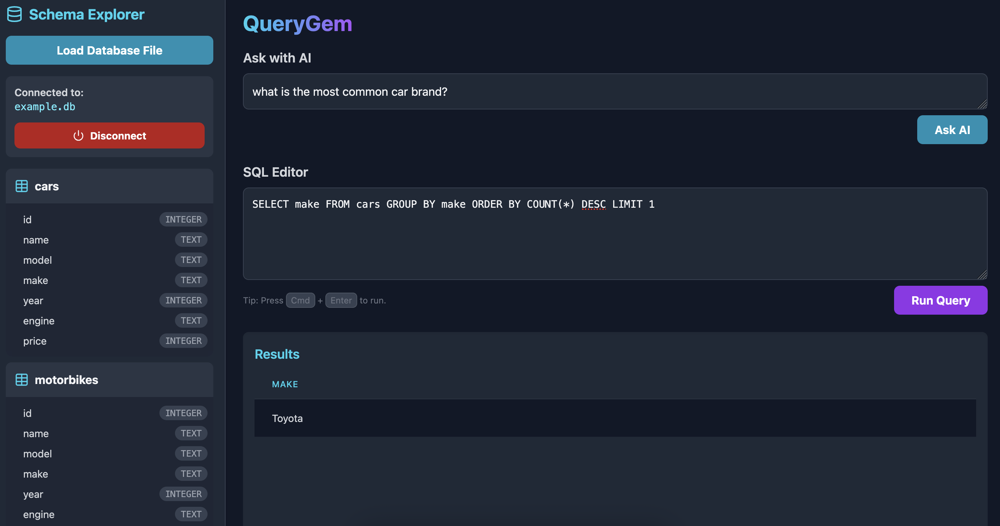

# QueryGem

QueryGem is a simple **local** in-browser client for interacting with local SQLite database files.
It provides a schema viewer, a manual SQL editor, and an AI-powered assistant to generate queries from natural language.

---

## Features

*   **Local First:** Your database file is processed entirely in your browser. It is never uploaded to a server, ensuring your data remains private.
*   **Schema Explorer:** Automatically discovers and displays your database's schema, including tables and their corresponding columns and data types.
*   **SQL Editor:** A responsive editor for writing and executing SQL queries directly against your database.
*   **AI-Powered Query Generation:** Ask questions in plain English and have the Gemini AI model generate the corresponding SQL query for you. This currently uses the `gemini-2.5-flash` model.

---

## Installation

Make sure you have `node` installed. If not, for example, (on a Mac) you can [install it using Homebrew](https://formulae.brew.sh/formula/node)
```zsh
brew install node
```

Next install dependencies:
```zsh
npm install
```

To run the app in `dev` model (which allows hot reloading for example), you can simply run:

```zsh
npm run dev
```

For running a lighter, "production"-like build, you can run:
```zsh
npm start
```

## Getting Started

1.  Launch the application in your web browser.
2.  Click the "Load Database File" button and select a local `.db`, `.sqlite`, or `.sqlite3` file from your computer.
3.  The database schema will appear in the sidebar on the left.
4.  Use the SQL Editor to write manual queries, or use the "Ask with AI" prompt to generate queries from natural language.
5.  The results of your query will be displayed in the main panel.

Examples:
For simple tests, there is a sample database in the `examples` directory of this repository.




---

## AI Feature Setup (API Key)

To use the "Ask with AI" feature, you must provide a Google Gemini API key. The application is designed to read this key from an environment variable.

The application looks for an environment variable named `GEMINI_API_KEY`.

```zsh
export GEMINI_API_KEY=your_google_ai_studio_api_key
```

---

## A Note on Data Privacy

QueryGem is built with data privacy as a top priority.

*   Your SQLite database file **never leaves your computer**. All database processing is handled locally within your browser using WebAssembly.
*   When using the AI query generation feature, only the **database schema** (table and column names) and your **natural language question** are sent to the Google Gemini API. Your actual data is not transmitted.
